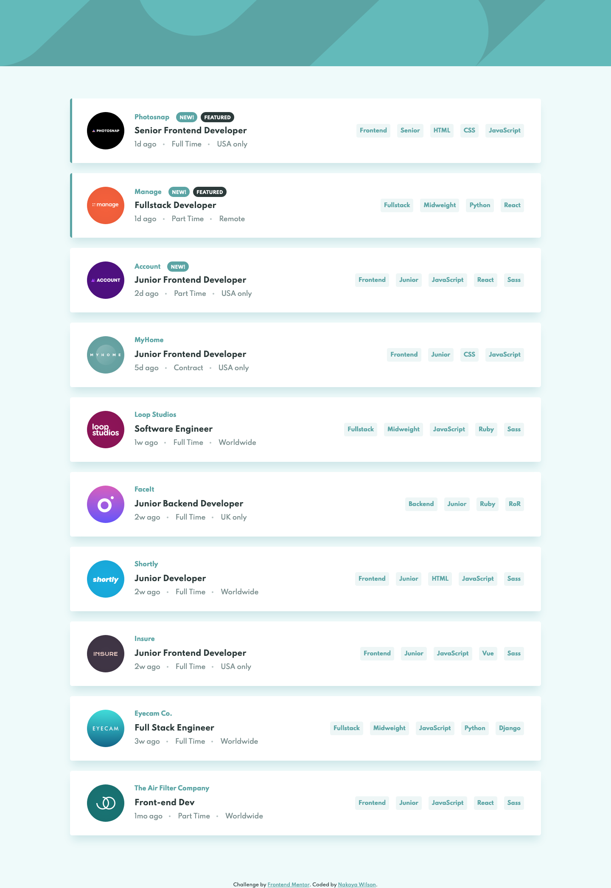

# Frontend Mentor - Job listings with filtering solution

This is a solution to the [Job listings with filtering challenge on Frontend Mentor](https://www.frontendmentor.io/challenges/job-listings-with-filtering-ivstIPCt). Frontend Mentor challenges help you improve your coding skills by building realistic projects.

## Table of contents

- [Overview](#overview)
  - [The challenge](#the-challenge)
  - [Screenshot](#screenshot)
  - [Links](#links)
- [My process](#my-process)
  - [Built with](#built-with)
  - [Useful resources](#useful-resources)
- [Author](#author)

## Overview

### The challenge

Users should be able to:

- View the optimal layout for the site depending on their device's screen size
- See hover states for all interactive elements on the page
- Filter job listings based on the categories

### Screenshot

### Links

- Solution URL: [https://github.com/nakoyawilson/static-job-listings](https://github.com/nakoyawilson/static-job-listings)
- Live Site URL: [https://nakoyawilson.github.io/static-job-listings/](https://nakoyawilson.github.io/static-job-listings/)

## My process

### Built with

- HTML
- CSS
- Mobile-first workflow
- [React](https://reactjs.org/)

### Useful resources

- [How filter array of objects by another array of objects - Stack Overflow](https://stackoverflow.com/questions/58133504/how-filter-array-of-objects-by-another-array-of-objects) - This question from Stack Overflow was instrumental in me realizing I could use the `every()` method to implement the filter functionality using multiple match criteria
- [Array.prototype.includes()](https://developer.mozilla.org/en-US/docs/Web/JavaScript/Reference/Global_Objects/Array/includes)
- [Array.prototype.every()](https://developer.mozilla.org/en-US/docs/Web/JavaScript/Reference/Global_Objects/Array/every)
- [Copyright Symbol in CSS :after Pseudo-Element - Stack Overflow](https://stackoverflow.com/questions/7770444/copyright-symbol-in-css-after-pseudo-element)

## Author

- Website - [Nakoya Wilson](https://nakoyawilson.netlify.app/)
- Frontend Mentor - [@nakoyawilson](https://www.frontendmentor.io/profile/nakoyawilson)
- Twitter - [@nakoyawilson](https://twitter.com/nakoyawilson)
- LinkedIn - [@nakoyawilson](https://www.linkedin.com/in/nakoyawilson/)
